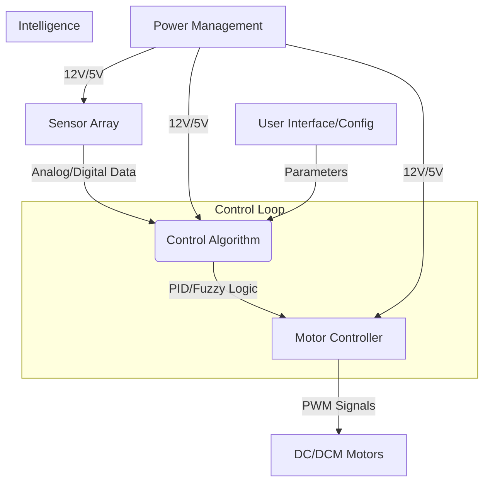

# System Architecture: Line Follower Elite

This document outlines the modular structure and data flow of the Line Follower robot.

## System Overview

The system is divided into five main modules, each responsible for a critical aspect of the robot's performance.

## Module Definitions

### 1. Intelligence (`_ALGORITHMS`)
- **PID Control**: Proportional, Integral, and Derivative control for smooth path tracking.
- **Decision Logic**: Handling intersections, gap detection, and speed adjustment.

### 2. Software Interface (`_SOFTWARE`)
- **Firmware (C++/Arduino)**: Low-level hardware control and timing.
- **CV Simulation (Python)**: Image processing and algorithm testing.

### 3. Hardware Stack (`_HARDWARE`)
- **QTR-8A Sensors**: Infrared reflectance sensors for line detection.
- **DRV8833/L298N**: Motor drivers for power amplification.

### 4. Energy & Circuits (`_ELECTRONICS`)
- **LiPo Battery Management**: Voltage regulation and protection.
- **PCB Design**: Signal integrity and compact component layout.

### 5. Chassis & Dynamics (`_MECHANICAL`)
- **Low Center of Gravity**: Optimized for high-speed cornering.
- **3D Printed Mounts**: Precise sensor positioning and weight distribution.
