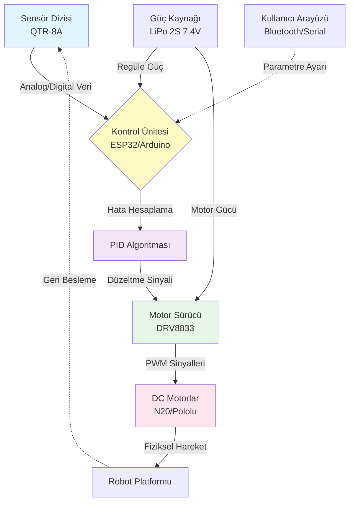
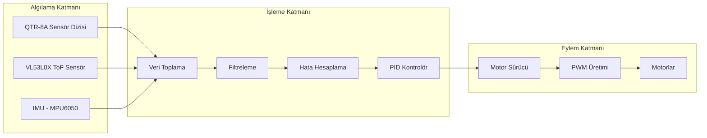
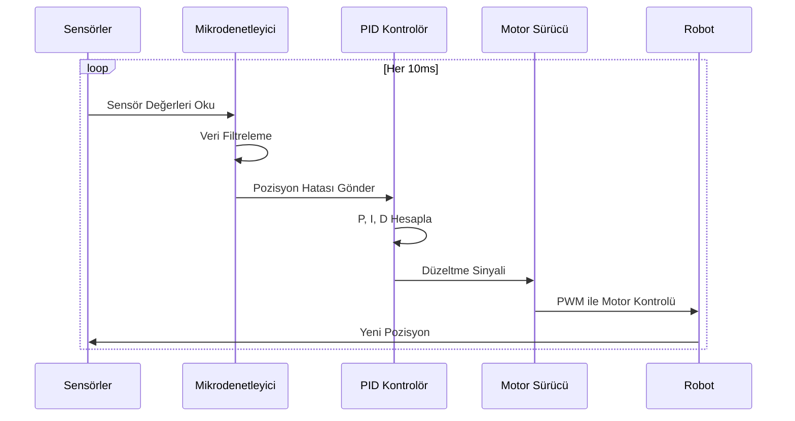
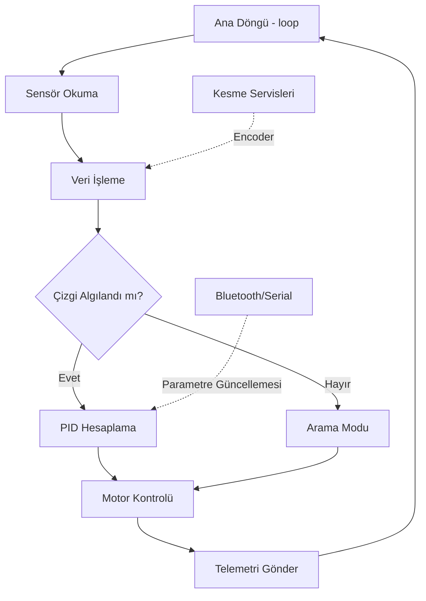
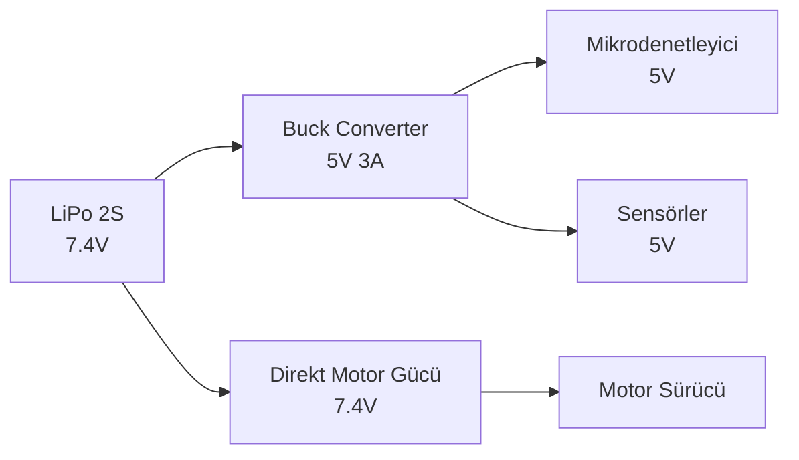

# ⚡ Çizgi Takibi Elite: Otonom Robot Kontrol Sistemi ⚡


[](https://opensource.org/licenses/MIT)
[](https://www.arduino.cc/)
[](https://www.python.org/)
[](https://opencv.org/)

---

## 📋 İçindekiler

- [Proje Hakkında](#-proje-hakkında)
- [Vizyon ve Misyon](#-vizyon-ve-misyon)
- [Modüler Yapı](#️-modüler-yapı-command-center)
- [Sistem Mimarisi](#️-sistem-mimarisi)
- [Teknik Özellikler](#-teknik-özellikler)
- [Donanım Bileşenleri](#-donanım-bileşenleri)
- [Yazılım ve Algoritmalar](#-yazılım-ve-algoritmalar)
- [Elektronik ve Güç Yönetimi](#-elektronik-ve-güç-yönetimi)
- [Mekanik Tasarım](#️-mekanik-tasarım)
- [Hızlı Başlangıç](#-hızlı-başlangıç)
- [Gelişmiş Kullanım](#-gelişmiş-kullanım)
- [Katkıda Bulunma](#-katkıda-bulunma)
- [Yol Haritası](#️-yol-haritası)
- [Lisans](#-lisans)
- [İletişim ve Geliştirici](#-i̇letişim-ve-geliştirici)

---

## 🎯 Proje Hakkında

**Çizgi Takibi Elite**, otonom çizgi izleyen robot teknolojileri için geliştirilmiş kapsamlı bir mühendislik ve yazılım dokümantasyon merkezidir. Bu proje, robotik yarışmalar, eğitim amaçlı uygulamalar ve endüstriyel otomasyon sistemleri için optimize edilmiş, yüksek performanslı bir çizgi takip sistemi sunmaktadır.

### Temel Özellikler

- **🧠 Gelişmiş Kontrol Algoritmaları**: PID, Fuzzy Logic ve adaptif kontrol sistemleri
- **⚡ Yüksek Hız Performansı**: Optimize edilmiş motor kontrol ve düşük gecikme süresi
- **🔧 Modüler Tasarım**: Kolay özelleştirme ve genişletme imkanı
- **📊 Gerçek Zamanlı Görüntü İşleme**: OpenCV tabanlı simülasyon ve test ortamı
- **🎓 Eğitim Odaklı**: Detaylı dokümantasyon ve öğrenme kaynakları
- **🏆 Yarışma Hazır**: Ulusal ve uluslararası robotik yarışmalar için optimize edilmiş

---

## 🚀 Vizyon ve Misyon

### Vizyon

Çizgi takip robotları alanında, açık kaynak topluluğuna en kapsamlı, en iyi dokümante edilmiş ve en yüksek performanslı çözümü sunmak. Robotik eğitiminde ve yarışmalarında referans kaynak olmak.

### Misyon

- **Eğitim**: Robotik ve kontrol sistemleri öğrenmek isteyenler için kapsamlı bir kaynak oluşturmak
- **İnovasyon**: Gelişmiş algoritma ve optimizasyon teknikleri ile performans sınırlarını zorlamak
- **Topluluk**: Açık kaynak felsefesi ile bilgi paylaşımını ve işbirliğini teşvik etmek
- **Erişilebilirlik**: Hem başlangıç hem de ileri seviye kullanıcılar için uygun çözümler sunmak

---

## 🛠️ Modüler Yapı (Command Center)

Proje, birbirinden bağımsız ancak entegre çalışabilen modüler bir yapıya sahiptir:

| Modül | Açıklama | Teknolojiler | Durum |
| :--- | :--- | :--- | :--- |
| [**`🧠 ALGORITHMS`**](/_ALGORITHMS) | PID, Fuzzy Logic ve Kontrol Teorisi | C++, Python, MATLAB | `✅ AKTİF` |
| [**`💻 SOFTWARE`**](/_SOFTWARE) | Gömülü Sistem ve Görüntü İşleme Kodları | Arduino C++, Python, OpenCV | `✅ AKTİF` |
| [**`⚙️ HARDWARE`**](/_HARDWARE) | Sensör, Motor ve Sürücü Teknik Verileri | QTR-8A, DRV8833, N20 | `✅ AKTİF` |
| [**`🔋 ELECTRONICS`**](/_ELECTRONICS) | Güç Yönetimi, PCB ve Devre Şemaları | KiCad, LiPo, Buck/Boost | `✅ AKTİF` |
| [**`🏎️ MECHANICAL`**](/_MECHANICAL) | Şase Tasarımı, Dinamik ve CAD Modelleri | Fusion 360, STL, STEP | `✅ AKTİF` |
| [**`📚 DOCUMENTATION`**](/_DOCUMENTATION) | Kullanım Rehberleri ve Teknik Makaleler | Markdown, LaTeX | `🔄 İLERLEME` |
| [**`📦 LEGACY`**](/_LEGACY) | Eski Versiyonlar, Taslaklar ve Arşiv | Python, Arduino | `📁 ARŞİV` |

---

## 🏗️ Sistem Mimarisi

### Genel Sistem Akışı



### Detaylı Mimari Katmanlar



### Veri Akış Diyagramı



---

## 🔬 Teknik Özellikler

### Performans Metrikleri

| Özellik | Değer | Açıklama |
|---------|-------|----------|
| **Maksimum Hız** | 3.5 m/s | Düz parkurda optimize edilmiş ayarlarla |
| **Döngü Süresi** | 5-10 ms | Sensör okuma + PID hesaplama + motor kontrol |
| **Sensör Çözünürlüğü** | 8 kanal | QTR-8A ile 1mm hassasiyet |
| **Güç Tüketimi** | 2-5 A | Yük ve hıza bağlı olarak değişir |
| **Pil Ömrü** | 15-30 dk | 2000mAh LiPo ile sürekli çalışma |
| **Ağırlık** | 150-300g | Konfigürasyona bağlı |
| **Boyutlar** | 15x10x8 cm | Standart yarışma boyutları |

### Desteklenen Platformlar

- **Mikrodenetleyiciler**: Arduino Nano, Arduino Uno, ESP32, STM32
- **Programlama Dilleri**: C/C++ (Arduino), Python (Simülasyon)
- **Geliştirme Ortamları**: Arduino IDE, PlatformIO, VS Code
- **Simülasyon**: Python + OpenCV, MATLAB/Simulink

---

## ⚙️ Donanım Bileşenleri

### Sensör Sistemleri

#### Ana Çizgi Sensörü: QTR-8A

**Pololu QTR-8A Reflektans Sensör Dizisi**, çizgi takip robotlarının kalbi olan yüksek hassasiyetli bir sensör dizisidir.

**Teknik Özellikler:**
- 8 adet kızılötesi LED ve fototransistör çifti
- Analog veya digital çıkış seçenekleri
- 8mm sensör aralığı (toplam 56mm algılama genişliği)
- 3.3V ve 5V uyumlu
- Ayarlanabilir parlaklık kontrolü

**Kullanım Senaryoları:**
- Standart siyah çizgi üzerinde beyaz zemin takibi
- Kesişim ve kavşak algılama
- Çizgi kalınlığı ve pozisyon hesaplama

```cpp
// QTR-8A Sensör Okuma Örneği
#include <QTRSensors.h>

QTRSensors qtr;
const uint8_t SensorCount = 8;
uint16_t sensorValues[SensorCount];

void setup() {
  qtr.setTypeAnalog();
  qtr.setSensorPins((const uint8_t[]){A0, A1, A2, A3, A4, A5, A6, A7}, SensorCount);
}

void loop() {
  uint16_t position = qtr.readLineBlack(sensorValues);
  // position: 0-7000 arası değer (0=en sol, 7000=en sağ)
}
```

#### Yardımcı Sensörler

**VL53L0X Time-of-Flight Mesafe Sensörü**
- 2m menzil
- ±3% hassasiyet
- Engel algılama ve duvar takibi için

**MPU6050 IMU (İnertial Measurement Unit)**
- 3 eksen gyro + 3 eksen ivmeölçer
- Dönüş açısı ve eğim ölçümü
- Gelişmiş stabilizasyon için

### Motor ve Sürücü Sistemleri

#### Motorlar

**Pololu Micro Metal Gearmotors**
- Yüksek performans yarışma motorları
- 1000-3000 RPM aralığı
- Farklı redüksiyon oranları (10:1, 30:1, 50:1, 100:1)
- Kompakt boyut (10mm çap)

**N20 DC Motorlar**
- Ekonomik ve güvenilir alternatif
- 100-1000 RPM
- Düşük gürültü seviyesi

#### Motor Sürücüleri

**DRV8833 Dual H-Bridge**
- 2 motor kontrolü
- 1.5A sürekli, 2A pik akım
- Düşük RDS(on) MOSFET'ler
- Termal koruma

**TB6612FNG Motor Sürücü**
- Yüksek akım kapasitesi (3.2A pik)
- PWM frekansı: 100kHz
- Standby modu ile enerji tasarrufu

```cpp
// Motor Kontrol Örneği (DRV8833)
const int MOTOR_L_IN1 = 5;
const int MOTOR_L_IN2 = 6;
const int MOTOR_R_IN1 = 9;
const int MOTOR_R_IN2 = 10;

void setMotorSpeed(int leftSpeed, int rightSpeed) {
  // Sol motor
  if (leftSpeed >= 0) {
    analogWrite(MOTOR_L_IN1, leftSpeed);
    analogWrite(MOTOR_L_IN2, 0);
  } else {
    analogWrite(MOTOR_L_IN1, 0);
    analogWrite(MOTOR_L_IN2, -leftSpeed);
  }
  
  // Sağ motor (aynı mantık)
  if (rightSpeed >= 0) {
    analogWrite(MOTOR_R_IN1, rightSpeed);
    analogWrite(MOTOR_R_IN2, 0);
  } else {
    analogWrite(MOTOR_R_IN1, 0);
    analogWrite(MOTOR_R_IN2, -rightSpeed);
  }
}
```

### Donanım Seçim Rehberi

> [!TIP]
> **Yarışma Robotu için**: Pololu motorlar + DRV8833 + ESP32 kombinasyonu
> 
> **Eğitim Amaçlı**: N20 motorlar + TB6612FNG + Arduino Nano kombinasyonu
> 
> **Dik Rampalı Pistler**: Yüksek tork için 100:1 redüksiyon oranı
> 
> **Yüksek Hız Pistleri**: Düşük tork, yüksek RPM için 10:1 veya 30:1 redüksiyon

---

## 💻 Yazılım ve Algoritmalar

### PID Kontrol Algoritması

**PID (Proportional-Integral-Derivative)** kontrolör, çizgi takip robotlarının temel kontrol algoritmasıdır. Robotun çizgiden sapmasını minimize ederek düzgün ve hızlı bir takip sağlar.

#### Matematiksel Model

Hata hesaplama:
$$\text{Error} = \text{TargetPosition} - \text{CurrentPosition}$$

PID bileşenleri:
$$P = K_p \times \text{Error}$$
$$I = I + (K_i \times \text{Error})$$
$$D = K_d \times (\text{Error} - \text{PreviousError})$$

Toplam düzeltme:
$$\text{Correction} = P + I + D$$

Motor hızları:
$$\text{LeftMotor} = \text{BaseSpeed} - \text{Correction}$$
$$\text{RightMotor} = \text{BaseSpeed} + \text{Correction}$$

#### PID Parametrelerinin Ayarlanması

**Kp (Proportional - Oransal)**
- Anlık hataya tepki verir
- Yüksek Kp: Hızlı tepki ama salınım (oscillation)
- Düşük Kp: Yavaş tepki ama stabil
- **Önerilen başlangıç değeri**: 0.05 - 0.15

**Ki (Integral - İntegral)**
- Kalıcı hataları giderir
- Yüksek Ki: Aşım (overshoot) riski
- Düşük Ki: Yavaş hata düzeltme
- **Önerilen başlangıç değeri**: 0.0001 - 0.001

**Kd (Derivative - Türev)**
- Hata değişim hızına tepki verir
- Yüksek Kd: Sönümleme etkisi, stabilite
- Düşük Kd: Hızlı değişimlere yetersiz tepki
- **Önerilen başlangıç değeri**: 0.5 - 2.0

#### PID Implementasyonu

```cpp
// PID Kontrolör Sınıfı
class PIDController {
private:
  float Kp, Ki, Kd;
  float integral;
  float previousError;
  unsigned long lastTime;
  
public:
  PIDController(float p, float i, float d) 
    : Kp(p), Ki(i), Kd(d), integral(0), previousError(0), lastTime(0) {}
  
  float calculate(float error) {
    unsigned long currentTime = millis();
    float deltaTime = (currentTime - lastTime) / 1000.0; // saniye cinsinden
    
    // P terimi
    float P = Kp * error;
    
    // I terimi (integral windup önleme ile)
    integral += error * deltaTime;
    integral = constrain(integral, -100, 100); // Sınırlama
    float I = Ki * integral;
    
    // D terimi
    float derivative = (error - previousError) / deltaTime;
    float D = Kd * derivative;
    
    // Değerleri güncelle
    previousError = error;
    lastTime = currentTime;
    
    return P + I + D;
  }
  
  void reset() {
    integral = 0;
    previousError = 0;
  }
};
```

### Gelişmiş Algoritmalar

#### Fuzzy Logic (Bulanık Mantık) Kontrolü

Bulanık mantık, PID'nin doğrusal yaklaşımının ötesinde, insan benzeri karar verme mekanizması sunar.

**Avantajları:**
- Doğrusal olmayan sistemlerde daha iyi performans
- Parametre ayarı daha sezgisel
- Farklı pist koşullarına adaptasyon

**Temel Yapı:**
1. **Fuzzification**: Sensör verilerini bulanık kümelere dönüştürme
2. **Inference**: Kural tabanlı karar verme
3. **Defuzzification**: Bulanık çıktıyı kesin motor komutlarına dönüştürme

#### Adaptif Hız Kontrolü

Pist geometrisine göre hızı otomatik ayarlama:

```cpp
int calculateAdaptiveSpeed(int baseSpeed, float curvature) {
  // Viraj keskinliğine göre hız azaltma
  float speedFactor = 1.0 - (abs(curvature) / 100.0);
  speedFactor = constrain(speedFactor, 0.5, 1.0);
  return baseSpeed * speedFactor;
}
```

#### Yol Tahmini (Path Prediction)

Sensör geçmişini kullanarak gelecekteki çizgi pozisyonunu tahmin etme:

```cpp
// Kalman filtresi veya basit moving average ile
float predictedPosition = (currentPos * 0.7) + (previousPos * 0.3);
```

### Yazılım Mimarisi



---

## 🔋 Elektronik ve Güç Yönetimi

### Güç Kaynağı

#### LiPo Pil Seçimi

**2S LiPo (7.4V Nominal, 8.4V Tam Şarj)**
- Kapasiteler: 500mAh - 2000mAh
- Deşarj oranı (C-rating): 25C - 50C
- Boyut/ağırlık dengesi önemli

**Güvenlik Önlemleri:**
> [!CAUTION]
> - LiPo pilleri asla 3.0V/hücre altına düşürmeyin
> - Şarj sırasında gözetimsiz bırakmayın
> - LiPo güvenlik çantası kullanın
> - Dengeleyici şarj (balance charging) yapın

#### Voltaj Regülasyonu



**Önerilen Regülatörler:**
- **LM2596**: Buck converter, 3A çıkış
- **XL4015**: Yüksek verimli (>90%), 5A kapasite
- **AMS1117**: Lineer regülatör (düşük akım uygulamaları için)

### PCB Tasarımı

#### Devre Şeması Prensipleri

1. **Güç Yolları**: Kalın izler (>1mm) motor akımları için
2. **Sinyal İzolasyonu**: Analog ve dijital toprakları ayırın
3. **Decoupling Kapasitörleri**: Her IC yakınına 100nF seramik kapasitör
4. **EMI Koruması**: Motor hatlarına ferrit boncuk

#### Örnek Bağlantı Şeması

```
[LiPo+] ─┬─ [Anahtar] ─┬─ [Motor Sürücü VIN]
         │              │
         │              └─ [Buck 5V] ─┬─ [MCU VIN]
         │                            │
         │                            └─ [Sensör VCC]
         │
[LiPo-] ─┴─ [GND] ──────────────────────┴─ [Ortak GND]
```

### Gürültü ve Parazit Önleme

**Motor Gürültüsü:**
- Motor uçlarına 100nF kapasitör
- Twisted pair kablo kullanımı
- Ferrit boncuk filtreler

**Sensör Sinyal Kalitesi:**
- Shielded kablolar (uzun mesafeler için)
- Pull-up/pull-down dirençleri
- Yazılımsal filtreleme (moving average, median filter)

---

## 🏎️ Mekanik Tasarım

### Şase Geometrisi

#### Wheelbase (Dingil Mesafesi) Optimizasyonu

**Kısa Wheelbase (8-10cm)**
- ✅ Hızlı dönüş kabiliyeti
- ✅ Dar virajlarda avantaj
- ❌ Yüksek hızda stabilite sorunu
- ❌ Sensör-tekerlek gecikmesi

**Uzun Wheelbase (12-15cm)**
- ✅ Yüksek hızda stabilite
- ✅ Düz parkurlarda üstünlük
- ❌ Yavaş dönüş
- ❌ Keskin virajlarda zorluk

#### Ağırlık Merkezi (Center of Gravity)

```
     [Sensörler - Hafif]
            ↑
     [Mikrodenetleyici]
            ↑
     [Pil - Ağır] ← Mümkün olduğunca alçak
            ↑
     [Motorlar - Orta]
```

**Optimizasyon İlkeleri:**
- Pili şasenin en alt noktasına yerleştirin
- Ağır bileşenleri merkeze yakın tutun
- Simetrik ağırlık dağılımı sağlayın

### Tekerlek ve Lastik Seçimi

**Tekerlek Çapı:**
- **30-40mm**: Standart, dengeli performans
- **50mm+**: Yüksek hız, düşük tork gereksinimi
- **25mm-**: Yüksek tork, kompakt tasarım

**Lastik Malzemesi:**
- **Silikon**: Maksimum tutuş, yumuşak yüzeyler
- **Kauçuk**: Dengeli, dayanıklı
- **Plastik**: Düşük sürtünme, kayma riski

### CAD Modelleme ve 3D Baskı

**Önerilen Yazılımlar:**
- Fusion 360 (ücretsiz eğitim lisansı)
- SolidWorks
- FreeCAD (açık kaynak)

**3D Baskı Parametreleri:**
- **Malzeme**: PLA (genel amaçlı), PETG (dayanıklılık), ABS (ısı direnci)
- **Dolgu Oranı**: %20-30 (hafiflik için), %50+ (dayanıklılık için)
- **Katman Yüksekliği**: 0.2mm (hız/kalite dengesi)

**Tasarım Dosyaları:**
- [`CHASSIS_V1.stl`](/_MECHANICAL) - Ana şase gövdesi
- [`SENSOR_MOUNT.step`](/_MECHANICAL) - Ayarlanabilir sensör montaj aparatı
- [`BATTERY_HOLDER.stl`](/_MECHANICAL) - LiPo pil tutucusu

---

## 🚦 Hızlı Başlangıç

### Gereksinimler

#### Donanım
- [ ] Arduino Nano / ESP32 / STM32
- [ ] QTR-8A Reflektans Sensör Dizisi
- [ ] 2x DC Motor (N20 veya Pololu)
- [ ] Motor Sürücü (DRV8833 / TB6612FNG)
- [ ] LiPo 2S Pil (7.4V, 1000-2000mAh)
- [ ] Şase ve Tekerlekler
- [ ] Bağlantı kabloları ve breadboard

#### Yazılım
- [ ] Arduino IDE 2.0+ veya PlatformIO
- [ ] QTRSensors kütüphanesi
- [ ] Python 3.10+ (simülasyon için)
- [ ] OpenCV (görüntü işleme için)

### Adım Adım Kurulum

#### 1. Donanım Montajı

**Sensör Montajı:**
```
1. QTR-8A'yı şasenin ön kısmına, yerden 3-5mm yüksekliğe monte edin
2. Sensör dizisini çizgiye paralel hizalayın
3. Kablo bağlantılarını yapın:
   - VCC → 5V
   - GND → GND
   - Sensör pinleri → A0-A7 (analog modda)
```

**Motor ve Sürücü Bağlantısı:**
```
Motor Sürücü (DRV8833):
- VM → LiPo+ (7.4V)
- GND → Ortak GND
- AIN1 → D5 (PWM)
- AIN2 → D6 (PWM)
- BIN1 → D9 (PWM)
- BIN2 → D10 (PWM)
- AOUT1/AOUT2 → Sol Motor
- BOUT1/BOUT2 → Sağ Motor
```

#### 2. Yazılım Yükleme

**Arduino IDE Kurulumu:**
```bash
# 1. Arduino IDE'yi indirin
https://www.arduino.cc/en/software

# 2. QTRSensors kütüphanesini yükleyin
Sketch → Include Library → Manage Libraries → "QTRSensors" ara ve yükle

# 3. Örnek kodu açın
File → Examples → QTRSensors → QTRRCExample
```

**PlatformIO ile (Önerilen):**
```bash
# 1. VS Code ve PlatformIO'yu yükleyin
# 2. Yeni proje oluşturun
pio init --board nanoatmega328

# 3. platformio.ini dosyasını düzenleyin
[env:nanoatmega328]
platform = atmelavr
board = nanoatmega328
framework = arduino
lib_deps = pololu/QTRSensors@^4.0.0

# 4. Kodu derleyin ve yükleyin
pio run --target upload
```

#### 3. Sensör Kalibrasyonu

```cpp
void calibrateSensors() {
  Serial.println("Kalibrasyon başlıyor...");
  Serial.println("Robotu çizgi üzerinde sağa sola hareket ettirin");
  
  for (int i = 0; i < 400; i++) {
    qtr.calibrate();
    delay(20);
  }
  
  Serial.println("Kalibrasyon tamamlandı!");
  
  // Kalibrasyon değerlerini yazdır
  for (int i = 0; i < SensorCount; i++) {
    Serial.print(qtr.calibrationOn.minimum[i]);
    Serial.print(' ');
  }
  Serial.println();
}
```

#### 4. PID Parametrelerini Ayarlama

**Ziegler-Nichols Yöntemi:**
```
1. Ki ve Kd'yi 0 yapın
2. Kp'yi yavaşça artırın
3. Robot sürekli salınım yapana kadar devam edin (Ku değeri)
4. Salınım periyodunu ölçün (Tu)
5. Parametreleri hesaplayın:
   Kp = 0.6 * Ku
   Ki = 2 * Kp / Tu
   Kd = Kp * Tu / 8
```

**Manuel Ayarlama:**
```
1. Kp = 0.1 ile başlayın
2. Robot çizgiyi takip edene kadar Kp'yi artırın
3. Salınım varsa Kd ekleyin (0.5 - 2.0)
4. Kalıcı hata varsa Ki ekleyin (0.0001 - 0.001)
5. İnce ayar yapın
```

### İlk Test

```cpp
void loop() {
  // Sensör okuma
  uint16_t position = qtr.readLineBlack(sensorValues);
  
  // Hata hesaplama (3500 merkez pozisyon)
  int error = position - 3500;
  
  // PID hesaplama
  float correction = pid.calculate(error);
  
  // Motor hızları
  int leftSpeed = baseSpeed - correction;
  int rightSpeed = baseSpeed + correction;
  
  // Hız sınırlama
  leftSpeed = constrain(leftSpeed, -255, 255);
  rightSpeed = constrain(rightSpeed, -255, 255);
  
  // Motor kontrolü
  setMotorSpeed(leftSpeed, rightSpeed);
  
  // Debug çıktısı
  Serial.print("Pos: "); Serial.print(position);
  Serial.print(" | Error: "); Serial.print(error);
  Serial.print(" | Correction: "); Serial.println(correction);
}
```

---

## 🎓 Gelişmiş Kullanım

### Kesişim ve Kavşak Algılama

```cpp
bool detectIntersection() {
  int activeCount = 0;
  for (int i = 0; i < SensorCount; i++) {
    if (sensorValues[i] > threshold) {
      activeCount++;
    }
  }
  // Tüm sensörler aktifse kesişim
  return (activeCount >= 6);
}
```

### Çizgi Kaybı Yönetimi

```cpp
void handleLineLoss() {
  static unsigned long lossStartTime = 0;
  static int lastKnownDirection = 0;
  
  if (lineDetected()) {
    lossStartTime = 0;
    lastKnownDirection = (position > 3500) ? 1 : -1;
  } else {
    if (lossStartTime == 0) {
      lossStartTime = millis();
    }
    
    // 500ms sonra arama modu
    if (millis() - lossStartTime > 500) {
      searchForLine(lastKnownDirection);
    }
  }
}
```

### Bluetooth Parametre Ayarlama

```cpp
void handleBluetoothCommands() {
  if (Serial.available()) {
    String cmd = Serial.readStringUntil('\n');
    
    if (cmd.startsWith("KP:")) {
      Kp = cmd.substring(3).toFloat();
      Serial.println("Kp güncellendi: " + String(Kp));
    }
    else if (cmd.startsWith("KI:")) {
      Ki = cmd.substring(3).toFloat();
    }
    else if (cmd.startsWith("KD:")) {
      Kd = cmd.substring(3).toFloat();
    }
    else if (cmd.startsWith("SPEED:")) {
      baseSpeed = cmd.substring(6).toInt();
    }
  }
}
```

### Python Simülasyon

```python
import cv2
import numpy as np

class LineFollowerSimulator:
    def __init__(self):
        self.robot_pos = [320, 400]
        self.robot_angle = 0
        self.Kp = 0.1
        self.Ki = 0.001
        self.Kd = 1.0
        
    def detect_line(self, frame):
        # Gri tonlama ve eşikleme
        gray = cv2.cvtColor(frame, cv2.COLOR_BGR2GRAY)
        _, binary = cv2.threshold(gray, 127, 255, cv2.THRESH_BINARY_INV)
        
        # Sensör pozisyonlarını simüle et
        sensor_positions = np.linspace(-50, 50, 8)
        sensor_values = []
        
        for pos in sensor_positions:
            x = int(self.robot_pos[0] + pos)
            y = int(self.robot_pos[1])
            if 0 <= x < binary.shape[1] and 0 <= y < binary.shape[0]:
                sensor_values.append(binary[y, x])
            else:
                sensor_values.append(0)
                
        return sensor_values
    
    def calculate_pid(self, error):
        # PID implementasyonu
        pass
    
    def update_position(self, correction):
        # Robot pozisyonunu güncelle
        pass
```

---

## 🤝 Katkıda Bulunma

Bu proje açık kaynaklıdır ve topluluk katkılarına açıktır!

### Nasıl Katkıda Bulunabilirsiniz?

1. **Fork** edin
2. Feature branch oluşturun (`git checkout -b feature/YeniOzellik`)
3. Değişikliklerinizi commit edin (`git commit -m 'Yeni özellik: XYZ'`)
4. Branch'inizi push edin (`git push origin feature/YeniOzellik`)
5. **Pull Request** açın

### Katkı Alanları

- 🐛 **Bug Raporları**: Sorun bulduğunuzda issue açın
- 📝 **Dokümantasyon**: Dökümantasyonu geliştirin veya çevirin
- 💡 **Yeni Özellikler**: Algoritma iyileştirmeleri, yeni sensör desteği
- 🧪 **Test**: Farklı donanım konfigürasyonlarında test edin
- 🎨 **Tasarım**: CAD modelleri, PCB tasarımları paylaşın

### Kod Standartları

- C++ için Google C++ Style Guide kullanın
- Python için PEP 8 standartlarına uyun
- Anlamlı commit mesajları yazın
- Kodunuzu dokümante edin

---

## 🗺️ Yol Haritası

### v1.0 (Mevcut)
- [x] Temel PID kontrolü
- [x] QTR-8A sensör desteği
- [x] Arduino ve ESP32 uyumluluğu
- [x] Modüler dokümantasyon yapısı

### v1.5 (Geliştirilmekte)
- [ ] Fuzzy Logic kontrolör implementasyonu
- [ ] Gelişmiş kesişim algılama
- [ ] Web tabanlı parametre ayarlama arayüzü
- [ ] Gerçek zamanlı telemetri ve veri loglama

### v2.0 (Planlanan)
- [ ] Makine öğrenmesi tabanlı optimizasyon
- [ ] Çoklu sensör füzyonu (IMU + ToF + Kamera)
- [ ] ROS (Robot Operating System) entegrasyonu
- [ ] Simülasyon ortamı (Gazebo/Webots)

### v3.0 (Vizyon)
- [ ] Otonom pist öğrenme ve haritalama
- [ ] Çoklu robot koordinasyonu
- [ ] Yapay zeka destekli adaptif kontrol
- [ ] Endüstriyel AGV uygulamaları

---

## 📄 Lisans

Bu proje **MIT Lisansı** altında lisanslanmıştır. Detaylar için [LICENSE](LICENSE) dosyasına bakınız.

```
MIT License

Copyright (c) 2025 Bahattin Yunus Çetin

Permission is hereby granted, free of charge, to any person obtaining a copy
of this software and associated documentation files (the "Software"), to deal
in the Software without restriction, including without limitation the rights
to use, copy, modify, merge, publish, distribute, sublicense, and/or sell
copies of the Software, and to permit persons to whom the Software is
furnished to do so, subject to the following conditions:

The above copyright notice and this permission notice shall be included in all
copies or substantial portions of the Software.
```

---

## 👨‍💻 İletişim ve Geliştirici

### Proje Sahibi

**Bahattin Yunus Çetin**  
*IT Architect & Robotics Engineer*

🎓 **Eğitim**: Karadeniz Teknik Üniversitesi, Of - Trabzon  
💼 **Uzmanlık**: Gömülü Sistemler, Otonom Robotlar, Kontrol Sistemleri

### Bağlantılar

[](https://github.com/bahattinyunus)
[](https://www.linkedin.com/in/bahattinyunus/)

### İletişim

- 📧 **E-posta**: [GitHub profili üzerinden](https://github.com/bahattinyunus)
- 💬 **Tartışmalar**: [GitHub Discussions](https://github.com/bahattinyunus/cizgi_takibi/discussions)
- 🐛 **Sorun Bildirimi**: [GitHub Issues](https://github.com/bahattinyunus/cizgi_takibi/issues)

---

## 🙏 Teşekkürler

Bu proje, açık kaynak topluluğunun katkıları ve aşağıdaki kaynakların desteğiyle geliştirilmiştir:

- **Pololu Corporation** - QTR sensör kütüphaneleri ve dokümantasyon
- **Arduino Community** - Geniş kütüphane ekosistemi
- **OpenCV Team** - Bilgisayarlı görü araçları
- **Robotik Yarışma Toplulukları** - Test ve geri bildirimler

---

## 📚 Ek Kaynaklar

### Öğrenme Materyalleri

- [PID Kontrol Teorisi](https://en.wikipedia.org/wiki/PID_controller)
- [Pololu QTR Sensör Rehberi](https://www.pololu.com/docs/0J19)
- [Arduino Motor Kontrol](https://www.arduino.cc/en/Tutorial/BuiltInExamples)

### Video Eğitimleri

- [Çizgi Takip Robotu Yapımı - Temel Seviye](https://youtube.com)
- [PID Ayarlama Teknikleri](https://youtube.com)
- [Gelişmiş Sensör Kalibrasyonu](https://youtube.com)

### Topluluk ve Forumlar

- [Arduino Forum - Robotics](https://forum.arduino.cc/c/using-arduino/robotics/14)
- [Reddit r/robotics](https://www.reddit.com/r/robotics/)
- [RoboCup Türkiye](https://www.robocup.org.tr/)

---

## 📊 Proje İstatistikleri


---

<p align="center">
  <b>⚡ Built with Passion for Robotics Engineering ⚡</b><br>
  <i>Elite Line Follower Project - 2025</i><br><br>
  <sub>Açık kaynak ile daha iyi bir robotik gelecek inşa ediyoruz 🤖</sub>
</p>

---

<p align="center">
  <a href="#-i̇çindekiler">↑ Başa Dön</a>
</p>
