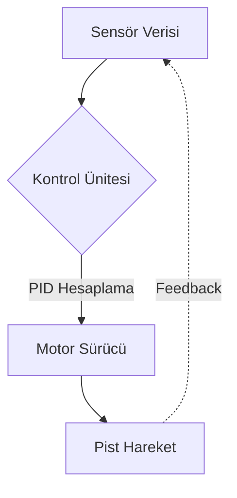

# ⚡ Çizgi Takibi Elite: Comprehensive Hub ⚡

## 🚀 Vision & Mission

**Çizgi Takibi Elite**, otonom çizgi izleyen robot teknolojileri için geliştirilmiş en kapsamlı mühendislik ve yazılım dökümantasyon merkezidir. PID algoritmalarından mekanik optimizasyona kadar her detayı kapsar.

---

## 🛠️ Modüler Yapı (Command Center)

| Modül | Açıklama | Durum |
| :--- | :--- | :--- |
| [**`🧠 ALGORITHMS`**](/_ALGORITHMS) | PID, Fuzzy Logic ve Kontrol Teorisi | `AKTİF` |
| [**`💻 SOFTWARE`**](/_SOFTWARE) | Arduino C++ ve Python CV Kodları | `AKTİF` |
| [**`⚙️ HARDWARE`**](/_HARDWARE) | Sensör ve Motor Teknik Verileri | `AKTİF` |
| [**`🔋 ELECTRONICS`**](/_ELECTRONICS) | Güç Yönetimi ve Devre Şemaları | `AKTİF` |
| [**`🏎️ MECHANICAL`**](/_MECHANICAL) | Şase Tasarımı ve Dinamik | `AKTİF` |
| [**`📚 DOCUMENTATION`**](/_DOCUMENTATION) | Rehberler ve Teknik Makaleler | `İLERLEME` |
| [**`📦 ARCHIVE`**](/_LEGACY) | Eski Versiyonlar ve Taslaklar | `ARŞİV` |

---

## 🏗️ Sistem Mimarisi

---

## 🚦 Hızlı Başlangıç

1.  **Donanım Seçimi**: [Donanım Rehberini](/_HARDWARE) inceleyerek robotunuzun ana bileşenlerini belirleyin.
2.  **Yazılım Yükleme**: [Yazılım Modülündeki](/_SOFTWARE) örnek kodları mikrodenetleyicinize yükleyin.
3.  **PID Ayarı**: [Algoritma Dokümanını](/_ALGORITHMS) takip ederek robotunuzun pist üzerindeki salınımını optimize edin.

---

## 🛡️ Lisans ve Katkı
Bu proje açık kaynaklıdır. Katkı sağlamak isteyenler `CONTRIBUTING.md` dosyasını inceleyebilir.

---

> [!IMPORTANT]
> **Uyarı:** Yüksek devirli motorlar ve LiPo pillerle çalışırken lütfen güvenlik protokollerine uyun.

---

  <b>Built with ❤️ for Robotics Engineers</b> 
  <i>Elite Engineering Hub - 2025</i>

