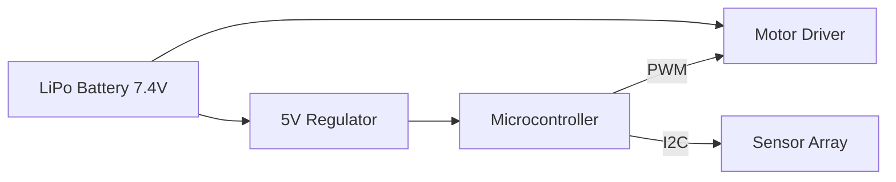

# Electronics & Power: The Nervous System

Schematics and power distribution strategies.

## Power Management
- **LiPo 2S (7.4V)**: Standard for high-speed robots.
- **Buck/Boost Converters**: Regulating stable 5V for Logic and 12V for Motors.

## Circuit Design
- **Signal Integrity**: Decoupling capacitors for motor noise suppression.
- **Microcontrollers**: ESP32 for high-speed processing or Arduino Nano for simplicity.

## Visuals

